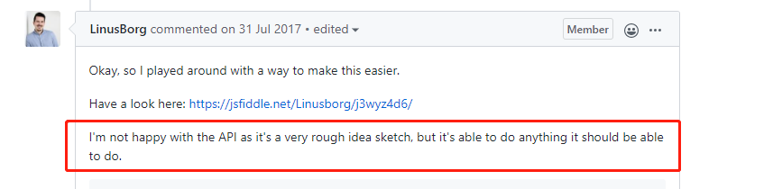

# VUE 高阶组件

## 核心问题及要点
- Vue 插槽$slot与父组件具有作用域引用关系

- 高阶组件场景中，Vue组件通过 $createElement 针对传入的组件创建新的组件实例，此时组件需要知道父组件具体传递的插槽内容，才能进行对应正确的渲染；

- 而在我们封装的高阶组件函数createHOC中，当前的$createElement并不是最终渲染出来的父组件对应的属性，是当前高阶组件的属性。所以在我们利用高阶组件的插槽的时候，需要设置当前创建插槽VNode的钩子this.$createElement为高阶组件的父节点的$createElement , 此时插槽就能进行正确地渲染。

### 总结 
- 渍渍渍，React 不香么 = =

   
